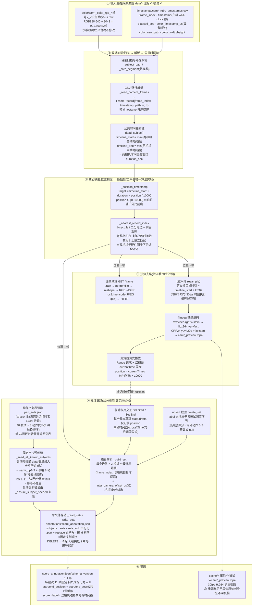

# RoboFit 打分平台数据管线技术架构

> 输入 = 双相机原始采集数据;输出 = 流畅预览 MP4(派生视图)+ 动作 Set 标注(score_annotation.json,锚定原始帧)。
> 全文行号均以 `scoring_platform/` 目录内当前代码为准。架构图使用 Mermaid,步骤解释紧跟在对应步骤之后。

## 总览架构图



---

## 步骤详解

### ① 输入:原始采集数据(平台只读)

| 项 | 说明 |
|---|---|
| `.raw` 帧文件 | 每帧 640×480×3 = 921,600 字节,RGB888 无压缩;文件名为 `cam{1,2}_color_rgb_{frame_index}_{color_timestamp_us}us.raw` |
| 时间戳 CSV | 每帧一行,含三套时钟:`timestamp`(主机系统时钟,Unix 秒)、`elapsed_sec`(主机相对采集起点)、`color_timestamp_us`(相机设备内部微秒计数器) |
| `docs/part_sets.json` | 动作序列表(由 xlsx 一次性生成并提交):48 个被试 × 8 个动作代码(Set1-4 × Technique/Challenge,每行顺序不同);平台启动时读取,标注卡片按此预创建,运行时无 Excel 依赖 |
| 路径 | `SCORING_DATA_ROOT` 默认 `../data`,平台**绝不写入、迁移或删除** data 下任何内容 |

**wall-clock 时间戳** = CSV 的 `timestamp` 列,是采集主机系统时钟在收帧瞬间的绝对 Unix 秒(如 `1787030382.463169`)。两路相机连同一台主机,该值两相机间**可直接比较**,是对齐的基础;但两路经独立 USB 管线传输存在毫秒级错位(CR12 实测边界处约 −15 ms),所以后续只做"各自找最近帧",不做绝对对齐。`color_timestamp_us` 是每台设备各自的计数器,不可跨相机比较,不参与对齐。

### ② 数据加载

| 步骤 | 做什么 | 方法/算法 | 实现位置 |
|---|---|---|---|
| 2.1 扫描校验 | 列出 data 下 日期/被试 目录,校验路径段防穿越 | `_safe_segment` 拒绝 `/ \ . ..`;`subject_path` resolve 后校验父目录 | backend.py:80-86, 212-218 |
| 2.2 CSV 解析 | 逐行读 `cam*_rgbd_timestamps.csv` → `FrameRecord{frame_index, timestamp, path, width, height}`,按 `timestamp` 升序排序 | DictReader + 容错跳过坏行 | backend.py:92-127 `_read_camera_frames` |
| 2.3 公共时间轴 | 两相机时间戳的**重叠窗口**:`timeline_start = max(两路首帧)`,`timeline_end = min(两路末帧)`;`duration_sec = end − start` | 无硬件同步下的统一时钟定义 | backend.py:239-250 `load_subject`(带 `@lru_cache(maxsize=4)`) |

### ③ 核心映射:位置刻度 → 原始帧(全平台唯一实现,三处复用)

| 步骤 | 做什么 | 方法/算法 | 实现位置 |
|---|---|---|---|
| 3.1 位置→公共时刻 | 时间轴滑块 `position ∈ [0,10000]` 映射为公共时间轴上的秒 | `target = timeline_start + duration × position/10000`(千分比线性映射) | backend.py:263 `_position_timestamp` |
| 3.2 时刻→原始帧 | 在该相机**自己的**时间戳数组上找离 target 最近的原始帧 | `bisect_left` 二分定位插入点,比较前一帧与后一帧,取时间差更小者;越界钳制到首/末帧 | backend.py:267-276 `_nearest_record_index` |

三个调用点共用同一份实现(这是"所见即所存"的构造性保证):
- **逐帧预览** `frame_preview`(backend.py:520, 529-530):屏幕上看到的帧
- **MP4 重采样** `generate_preview_sync`(backend.py:392):视频第 k 帧
- **Set 边界解析** `_build_set`(backend.py:700, 712-720):落盘的帧

前端镜像公式:`draftTime`(app.js:301),草稿显示用同一公式,刻意不用 MP4 时长。

### ④ 预览支路

| 步骤 | 做什么 | 方法/算法 | 实现位置 |
|---|---|---|---|
| 4.1 逐帧预览 | 按需渲染任意 position 的 JPEG | `.raw` → `np.fromfile` → reshape → `cv2.cvtColor(RGB2BGR)` → `cv2.imencode(.jpg, q86)`;响应头带 `X-Frame-Index`/`X-Frame-Timestamp` | backend.py:520-560 `frame_preview` |
| 4.2 **重采样(resample)** | 把"不均匀采样的原始帧序列"重排到**均匀 30fps 网格** | 对每个输出帧 k:目标时刻 `t_k = timeline_start + k/30`,再执行 3.1+3.2 的最近帧匹配,取出的原始帧字节流写进 ffmpeg stdin | backend.py:331-410 `generate_preview_sync`(核心循环 387-397) |
| 4.3 H.264 编码 | 原始帧序列 → MP4 | `ffmpeg -f rawvideo -pixel_format rgb24 -framerate 30 -i pipe:0 -c:v libx264 -preset veryfast -crf 24 -pix_fmt yuv420p -movflags +faststart`;`.part.mp4` 成功后 rename;双相机各自独立生成 | backend.py:363-374 |
| 4.4 播放同步 | 浏览器流式播放,双视频对齐,时间轴回写 | `<video>` Range 请求;`videoPlaybackTick` 以 cam1 为主,`|ΔcurrentTime|>0.08s` 时校正 cam2;`position = currentTime/MP4时长×10000` | app.js:509-527 |

> **重采样在哪一步?** 就在 4.2。含义:原始帧由相机按不均匀节奏(≈29.96fps,带抖动)采集,视频格式要求均匀帧率,于是对每个 1/30s 网格点"挑一张最近的原始帧"。代价是**丢失原始帧身份**——MP4 第 k 帧无法反推它来自哪个原始帧号,因此 MP4 只能作为视图,标注必须走 ⑤ 支路直接锚定原始帧。

### ⑤ 标注支路

| 步骤 | 做什么 | 方法/算法 | 实现位置 |
|---|---|---|---|
| 5.1 序列表读取 | 读取 `docs/part_sets.json` → `{被试编号: [8 个动作代码]}`(48 被试 × 4 种轮换顺序) | 纯 JSON 读取(由 xlsx 一次性生成并提交,运行时零 Excel 依赖);失败(缺失/损坏)告警并返回空表,health 显示 `part_sets_loaded` | backend.py:145-163 `_read_part_sets_json`;启动加载于 create_app |
| 5.2 卡片预创建 | **启动时批量预录入**:扫描 data 目录,把表格中存在的被试一次性写入标注 JSON(11 张空卡片/人);启动后新出现的被试由惰性播种兜底 | 序列 = `warm_up1/2/3` + 表格 8 代码(按表格顺序);ids 1..11 = 序列顺序;边界/分数全 null、cameras={};**幂等:已存在的条目绝不覆盖**(保护已有标注);不在表格中不播种 | backend.py `_seed_all_known_subjects`(启动时调用)+ `_ensure_subject_seeded`(锁内兜底) |
| 5.3 卡片标记 | 每张卡片独立的 Set Start / Set End,只记当前 `position` 刻度(两种预览模式共用) | 前端 `state.drafts[cardId]` 存起止;起止顺序校验;草稿时间用 `draftTime` 换算(与后端同公式) | app.js:403-418 `captureCardBoundary` / 301 `draftTime` |
| 5.4 upsert 校验 | 保存 = 按 label upsert 卡片:已存在 → 原位更新(保留 id/created_at,200);缺失 → 补建(201) | label 必须属于该被试固定序列(否则 400);位置 0..10000 且 start<end;热身禁评分(400),评分动作 0-5 整数或 null;PATCH 仅改分,热身 → 400 | backend.py:768-805 `create_set`;807-826 `update_set_score` |
| 5.5 边界解析 | 每个边界(起/止)× 2 相机 = 各相机**真实录到的最近原始帧** | 对边界时刻执行 3.1+3.2;存储 {frame_index, 该相机自身 timestamp};另算 `inter_camera_offset_us = (cam1−cam2)×1e6` 作双相机错位诊断 | backend.py:700-759 `_build_set` |
| 5.6 单文件存储 | 所有被试的标注写入同一个文件 | `annotations/score_annotation.json`(`SCORING_ANNOTATION_ROOT` 可覆盖);`sets_lock` 串行化读-改-写;`.part` + `replace` 原子写;损坏文件读取容错(下次保存覆盖);**按 id 升序 = 固定序列顺序**(upsert/清除不改 id,顺序恒稳定) | backend.py:623-652 `_read_annotations`/`_read_sets`/`_write_sets` |
| 5.7 卡片交互(左侧边栏) | 被试列表卡片点"录入"→ 边栏切换为该被试的标注视图,11 张卡片纵向排列(顺序即固定序列),预览窗口始终保留在右侧;退出标注返回列表 | 前端 `renderSetCards` 渲染到边栏 `annotationList`,按 id 排序;每卡独立 Set Start/End、保存 = POST upsert(在途守卫)、清除 = DELETE(confirm,卡片保留仅清数据);已标记卡片点击跳时间轴;热身卡无评分控件 | app.js `renderSetCards`/`saveCard`/`clearCard`/`enterAnnotation`/`updateSidebarView` |

### ⑥ 输出

**`annotations/score_annotation.json`**(分析用,锚定原始帧;每个被试固定 11 张卡片,未标记的卡片字段为 null):

```json
{
  "schema_version": "1.1.0",
  "subjects": {
    "2026_8_18/CR12": {
      "date": "2026_8_18", "subject_id": "CR12",
      "sets": [
        {
          "id": 1, "label": "warm_up1",
          "start_position": null, "end_position": null,
          "start_sec": null, "end_sec": null, "duration_sec": null,
          "score": null, "cameras": {},
          "created_at": "2026-08-19T07:02:11.000000+00:00", "updated_at": "2026-08-19T07:02:11.000000+00:00"
        },
        {
          "id": 4, "label": "B2T",
          "start_position": 1000, "end_position": 2000,
          "start_sec": 1787030517.240585, "end_sec": 1787030618.123456,
          "duration_sec": 100.882871, "score": 4,
          "cameras": {
            "cam1": { "start": { "frame_index": 4063, "timestamp": 1787030517.240585, "inter_camera_offset_us": -15331 }, "end": { ... } },
            "cam2": { "start": { "frame_index": 4046, "timestamp": 1787030517.255916, "inter_camera_offset_us": 15331 }, "end": { ... } }
          },
          "created_at": "...", "updated_at": "..."
        }
      ]
    }
  }
}
```

| 字段 | 含义 |
|---|---|
| `id` / `label` | 卡片编号与动作名:ids 1..3 = warm_up1-3,ids 4..11 = 表格 8 动作代码(按该被试的表格顺序);清除/upsert 均不改变 |
| `*_position` / `*_sec` | 时间轴刻度 0..10000 与公共时间轴秒;未标记时为 null |
| `score` | 0-5 整数或 null;热身卡片恒为 null |
| `cameras.cam1/cam2.*.frame_index` | 该相机在边界处**真实录到的原始帧号**,直接用 `color/cam*_color_rgb_<frame_index>_<us>us.raw` 取原始数据 |
| `cameras.*.*.timestamp` | 该原始帧自己的 wall-clock 时间戳 |
| `inter_camera_offset_us` | 边界处双相机时间戳错位量(µs),诊断信息 |

**`cache/<日期>/<被试>/cam*_preview.mp4`**:30fps H.264 派生视图,仅供浏览,可随时删除重建(原始数据不受影响)。

---

## 准确性结论(预览画面 vs 存储帧)

| 模式 | 保证 | 说明 |
|---|---|---|
| 逐帧模式标记 | **逐帧精确** | 所见即所存:屏幕渲染与落盘走同一份 3.1+3.2 算法(同输入必同输出),真实数据验证帧 4063 == 存储 4063 |
| 视频模式标记 | **有界近似**,通常 0~1 帧(±33ms@30fps) | 误差来源:①MP4 重采样网格 ±16.7ms;②浏览器 currentTime 连续值与显示帧差半个视频帧;③MP4 时长 = 帧数/30 与 subject 时长存在 ≤33ms 取整差。存储的 timestamp 永远是真实采集值,不编造 |

需要严格帧级边界的场景,建议在逐帧模式下标记,或用视频定位后切回逐帧模式微调再标记。
